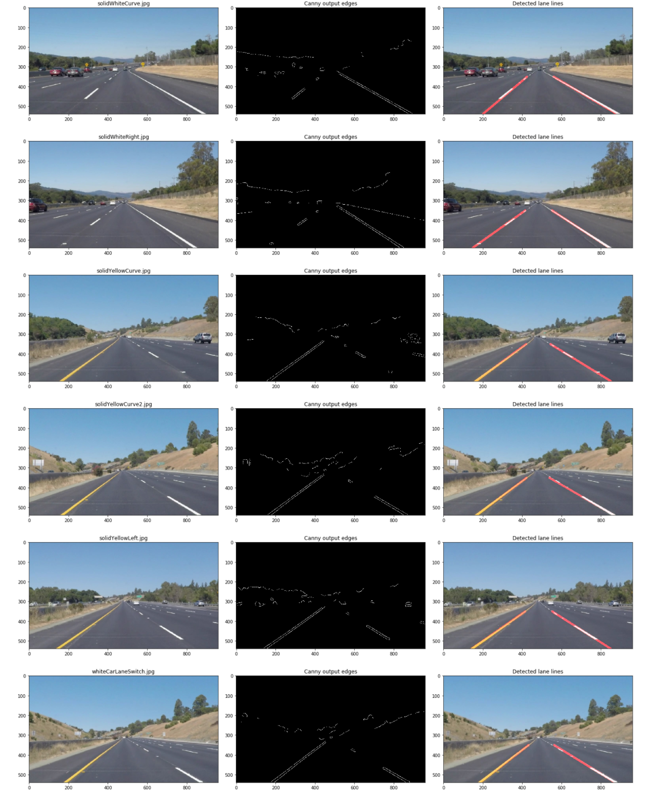

# **Thanh Doan: Finding Lane Lines on the Road** 
[](http://www.udacity.com/drive)

The goals of this project are the following:
* Implement a [pipeline](P1.ipynb) that finds lane lines on the road
* Reflect on this project work

---

## **Pipeline implementation**

The **Pipeline** is implemented in [P1.ipynb](P1.ipynb) Jupyter notebook. 
- The result of running Pipeline on 6 images from **test_images** input folder is store at **test_images_output**
- The result of running Pipeline on 3 videos from **test_videos** input folder is store at **test_videos_output**

## **Reflection**

### **[Hough.py](hough.py)** 

Finding a *common set* of Canny and Hough parameter values that work with all given images and videos was quite a challenge. In order to quickly explore and debug I wrote, [hough.py](hough.py), a tool that read in any given image file and visualize Canny transform output and Hough line segments in side-by-side windows with interactive GUI controls. GUI controls uses OpenCV mouse callback and trackbar event handler to call Canny and Hough functions with parameter values obtaining from trackbar position, mouse_x and mouse_y values. 

The output images from Canny and Hough function calls are displayed interactively and instantly when there is a change in a parameter trackbar inside visualization windows.

With hough.py I can quickly find working Canny and Hough parameter values, like thresholds, for any given image I need to investigate and debug.

### **The pipeline**

I use [hough.py](hough.py) to explore and found a set of *common* parameter values for Canny and Hough transforms that *work pretty well* with 6 images inside **test_images** folder. Those parameter values also work with an *abitrary set of frames* from 3 video files inside **test_videos** folder. I then encode those parameters in the implementation of the **Pineline** class below.

```python
class Pipeline:    
    """
    Construct a Pipeline object given an RGB image img, 
    and region of interest roi_vertices.
    Constructor sets up default parameters for Canny and Hough transforms.
    """
    def __init__(self, img, roi_vertices):
        self.img = img

        # roi_vertices is polygon vertices defining region if interest
        self.roi_vertices = roi_vertices

        # Kernel size, sigma parameters for gaussian_blur function
        self.blur_ksize = 11
        self.blur_sigmaX = 4
        
        # Thresholds for Canny transform
        self.canny_threshold_low = 50
        self.canny_threshold_hi = 100

        # Distance, angular resolution of grid in Hough space
        self.rho = 2
        self.theta = np.pi/180

        # Number of votes a candidate line needs to have
        # Ie. Number of sinusoids in a cell defined by (rho, theta) in Hough space
        self.threshold = 51

        # Minimum length of a line (in pixels) accepted
        self.min_line_length = 85

        # Max distance between segments allowed tobe connected into a single line
        self.max_line_gap = 100
    
    def find_lanes_onImage(self):
        gray = grayscale(self.img)
        blur_img = gaussian_blur(gray, self.blur_ksize, self.blur_sigmaX)

        edges = canny(blur_img, self.canny_threshold_low, self.canny_threshold_hi)
        masked_edges = region_of_interest(edges,  np.array([self.roi_vertices]))

        lines = hough_lines(masked_edges, self.rho, self.theta, 
            self.threshold, self.min_line_length, self.max_line_gap)
        out_image = weighted_img(self.img, lines)
        
        return edges, lines, out_image
    
```

- All Canny edge detection and Hough transform parameters are encoded as **Pipeline** class properties.
- The use of *class properties*, not parameters list for **find_lanes_onImage()** function is intentional.
- With *class properties*, the caller can change any property at runtime cleaner.
- Class constructor create a Pipeline object to find lanes for any **region of interest** on any image
  - **roi_vertices** defines the region of interest formed by given polygon vertices

The main logic of my **Pipeline**, implemented in **find_lanes_onImage()** function, consisted of 6 steps.
  - Convert the image *self.img* to grayscale for faster processing
  - Use a Gaussian filter with parameterized kernel size and Gauss/normal distribution variance sigmaX to blur (smooth out) the image for Canny edge detection.
  - Call **canny()** function with *thresholds* arguments from Pipeline property values. This step output an image with only high intensity pixels representing detected edges.
  - Call **region_of_interest()** to set all pixels outside polygon region of interest to 0.
  - Call **hough_lines()**, which call OpenCV HoughLinesP() functions to find a list of line segments, then call  **draw_lines()** to extrapolate hough line segments into `x=m*y+b` lines.
  - Call **weighted_img()** to merge lines image from previous step with original image for final display.


### **The draw_lines() function**

I modified the draw_lines() function and implement a loop to iterate each line from the list of lines returned by **cv2.HoughLinesP()** call. For each (x1, y1, x2, y2) tuple I compare x1, x2 with the middle value **mid_x** and add (x, y) values to xleft_vals, yleft_vals or xright_vals, yright_vals arrays correspondingly.

I then use *xleft_vals, yleft_vals* arrays to fit line coeficients `m` and `b` for ``x=m*y+b`` left line using `np.polyfit(yleft_vals,  xleft_vals,  1)` function and use *xright_vals, yright_vals* arrays to fit coeficients `m` and `b` for ``x=m*y+b`` right line using `np.polyfit(yright_vals,  xright_vals,  1)` function.

Once I have line coeficients `m, b` for left and right lanes I set *(y1, y2)* to *(img.shape[0], img.shape[0]x0.65)* and use line equation ``x=m*y+b`` to compute the corresponding *(x1, x2)* values. 

Finally I use `cv2.line(img, (x1, y1), (x2, y2), color, thickness)` function to draw left and right lanes accordingly. The full code for draw_lines() is listed below. 

```python
def draw_lines(img, lines, color=[255, 0, 0], thickness=2):
    """
    This function draws `lines` with `color` and `thickness`.    
    Lines are drawn on the image inplace (mutates the image).
    """
    mid_x = img.shape[1] // 2        
    xleft_vals = []
    yleft_vals = []    
    xright_vals = []
    yright_vals = []
    for line in lines:
        for x1, y1, x2, y2 in line:
            if x1 < mid_x and x2 < mid_x:
                xleft_vals.append(x1)
                yleft_vals.append(y1)
                xleft_vals.append(x2)
                yleft_vals.append(y2)                
            elif x1 > mid_x and x2 > mid_x:
                xright_vals.append(x1)
                yright_vals.append(y1)
                xright_vals.append(x2)
                yright_vals.append(y2)

    if len(yleft_vals) > 1 and len(xleft_vals) > 1:
        left_fit  = np.polyfit(yleft_vals,  xleft_vals,  1)
    
        # left line x = my + b
        m = left_fit[0]
        b = left_fit[1]
    
        y1 = int(img.shape[0])
        x1 = int(m*y1 + b)
    
        y2 = int(img.shape[0]*0.65)
        x2 = int(m*y2 + b)
        cv2.line(img, (x1, y1), (x2, y2), color, thickness)

    if len(yright_vals) > 1 and len(xright_vals) > 1:
        right_fit = np.polyfit(yright_vals, xright_vals, 1)

        # right line x = my + b
        m = right_fit[0]
        b = right_fit[1]

        y1 = int(img.shape[0])
        x1 = int(m*y1 + b)

        y2 = int(img.shape[0]*0.65)
        x2 = int(m*y2 + b)
        cv2.line(img, (x1, y1), (x2, y2), color, thickness)
```

The code below show how to use the **Pipeline** to process 6 input images inside **test_images** folder.

```python
def find_lanes(image_files, show_plot = False):
    roi_vertices = [(432, 322), (534, 322), (873, 535), (133, 533)]
    for image_file in image_files:
        image = mpimg.imread(image_file)
        
        pline = Pipeline(image, roi_vertices)
        edges, lines, out_image = pline.find_lanes_onImage()
                
        path, fname = os.path.split(image_file)
        file, ext = os.path.splitext(fname)
        edges_filename = os.path.join("test_images_output", file + "-edges" + ext)
        out_filename = os.path.join("test_images_output", file + "-lines" + ext) 
        plt.imsave(edges_filename, edges)
        plt.imsave(out_filename, out_image)
        if show_plot:
            fig, (ax1, ax2, ax3) = plt.subplots(1, 3, figsize=(20,20))
            fig.tight_layout()
            ax1.imshow(image)
            ax1.set_title(fname)            
            ax2.imshow(edges, cmap='gray')
            ax2.set_title('Canny output edges')
            ax3.imshow(out_image)
            ax3.set_title('Detected lane lines')    

test_images = ['test_images/' + fname for fname in os.listdir("test_images/")]
find_lanes(test_images, True)

```

The result of running the the **Pipeline** to process 6 input images inside **test_images** folder.: 




The result of running the the **Pipeline** to process **test_videos/solidYellowLeft.mp4** as the input as below.

```python

def process_image(image):

    # To ensure flexibility the region of interest is defined by a paramaterized polygon
    roi_vertices = [(432, 322), (534, 322), (873, 535), (133, 533)]
    pline = Pipeline(image, roi_vertices)
    _, _, result = pline.find_lanes_onImage()
    return result

yellow_output = 'test_videos_output/solidYellowLeft.mp4'
clip2 = VideoFileClip('test_videos/solidYellowLeft.mp4')
yellow_clip = clip2.fl_image(process_image)
yellow_clip.write_videofile(yellow_output, audio=False)
```
[](https://www.youtube.com/watch?v=IKWfdrJ3A0M "solidYellowLeft.mp4")

## **Potential shortcomings with my current Pipeline**

One potential shortcoming would be what would happen when ... 

Another shortcoming could be ...


## **Possible improvements**

A possible improvement would be to ...

Another potential improvement could be to ...
